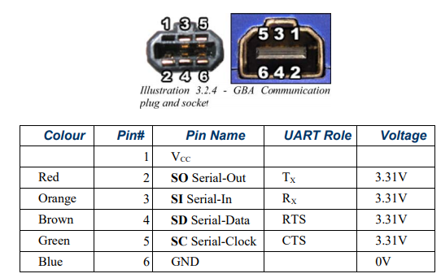
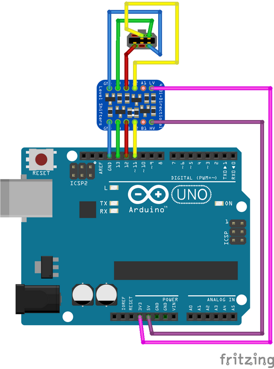
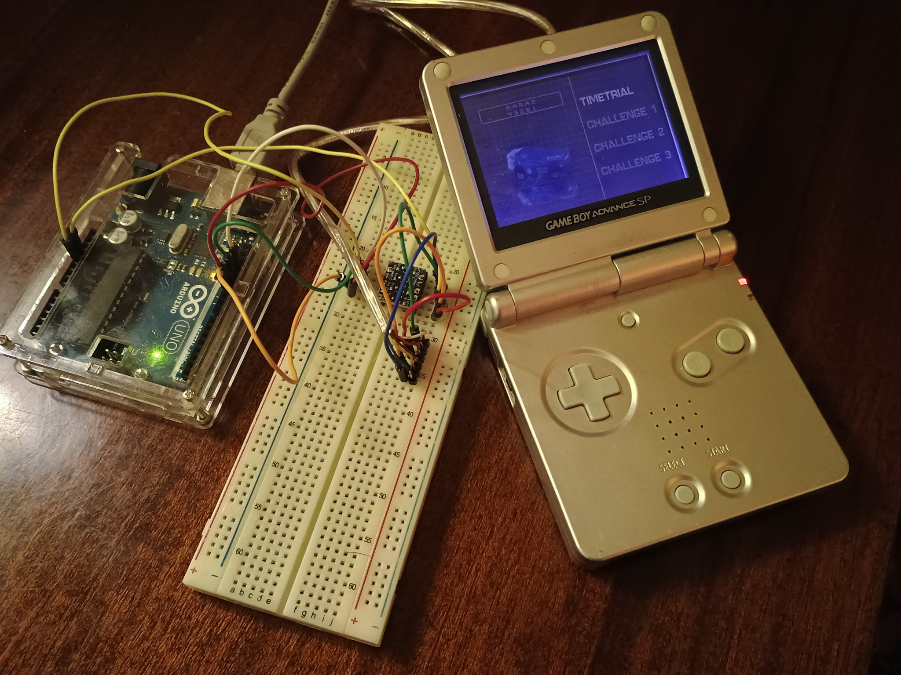

# gba-multiboot-go

This tool allows sending Multiboot ROMs (small 256KiB programs that fit in EWRAM) via Arduino UNO.

## Hardware

 - GameBoy Advance
 - Arduino UNO
 - 4-channel Bi-directional Logic Level Converter
 - GBA link connector

### Schematics

| GBA pin      | Arduino UNO pin |
|--------------|-----------------|
| 2 (SO)       | 12              |
| 3 (SI)       | 11              |
| 5 (SC)       | 13              |
| 6 (GND)      | GND             |




## Software

- [Arduino IDE](https://www.arduino.cc/en/software)
- [Golang](https://go.dev/dl/) >v1.19
- Multiboot ROMs (can be found on the web, usually featuring the .mb extension)[[!]](https://archive.org/details/nintendo-game-boy-advance-multi-boots-20070704.-7z)

### Arduino

Upload sketch `Arduino\Arduino.ino` to your Arduino UNO.

### Build

```
go build -o gba-multiboot.exe main.go
```

### Usage

```
gba-multiboot.exe [COM port (Default: "COM3")] [Baud Rate (Default: 57600)] <file (.mb)>
```

Name | Argument |Default | Description
--- | --- | --- | ---
Com port | optional | COM3 | What port is using arduino
Baud Rate | optional | 57600 | Baud rate
file | required |  | Multiboot ROM file


## How to use

Run gba-multiboot-go tool (example: `gba-multiboot.exe game.mb`) and turn on your GBA without a game pak, plug everything in. If you need to have a game pak installed for whatever reason, hold down START+SELECT on startup to cancel booting the game pak.



## Credits

- GBA multiboot writer by [gba_03_multiboot](https://github.com/akkera102/gba_03_multiboot)
- Arduino loader sketch [elm-gba-multiboot](https://github.com/ataulien/elm-gba-multiboot)
- Documentation: [GBATEK](https://problemkaputt.de/gbatek.htm)